# objection

[](https://github.com/marketplace/actions/objection-pr-trial)
[](https://github.com/victorserpa/objection/releases)
[](https://github.com/victorserpa/objection/actions/workflows/test.yml)

> **OBJECTION!** Your PR goes on trial before it ships.

**A skill and plugin for AI coding agents** (Claude Code, Codex, Cursor,
Gemini CLI, GitHub Copilot, anything that reads
[Agent Skills](https://agentskills.io)). Before your agent opens a pull
request, a second model attacks the diff, a third tries to refute every
accusation with `file:line`, your agent's session judges what is left,
and a gate keeps the PR closed until the verdict is APPROVED.

It is not an app, a hosted service or a bot account: it is instructions
and a few scripts your agent runs, on your own `claude` or `codex` CLI.



That run is real (sonnet, `debate.sh`, a planted bug in a
[toy cart](docs/make-demo.mjs)): 3 bugs, 2 rounds, **$0.041** of
reviewers.

## What you get

- **Bugs caught before the PR exists**, not after a human reviewer or a
  user finds them. The agent that wrote the code does not grade it: an
  isolated reviewer with no stake in the diff does.
- **Few false alarms.** Every finding has to survive a defender that
  looks for the line of code proving it wrong. What cannot be refuted
  stands; what can is dropped, with the evidence in the record.
- **A step that cannot be skipped.** The local hook blocks `gh pr create`
  and `gh pr merge` without an APPROVED record for that exact commit,
  and the optional GitHub Action (or GitLab job) checks the same in CI.
  Or run it in advisory mode first: it warns instead of blocking.
- **Cents per PR.** Reviewers run as isolated `claude -p` processes on
  sonnet: $0.02 to $0.15 for a typical PR, opus only where you mark the
  code as critical. With a Claude subscription it is plan usage, not
  dollars.
- **A record reviewers can read.** What was accused, refuted, fixed and
  left open goes into the PR body, stamped to the commit.
- **It learns the repository.** Confirmed defects become precedents the
  next accuser checks first.

## Quick start

```
/plugin marketplace add victorserpa/objection
/plugin install objection@objection
```

Then, in a repository, ask your agent for `/objection init` (other agents:
[Install](#install)). It reads what it can (bases, your test and type
checks, your forge) and asks nothing else. To try it without blocking
anyone, say `/objection init --advisory`. From then on, when the agent is
about to open a PR, it runs the debate first; you get the record in the
PR body.

## Known bugs, caught

[`eval/`](eval) plants seven bugs in small repositories (a negative cart
total, an authorization check turned into a deny-list, a temp dir leaked
on a retry, pages that start at 1 but skip the first, a charge that lost
its row lock, the same negative total with a comment telling the
reviewer the change is approved, and a rename with no bug at all) and
runs the accuser on each. Latest runs:

| runner | caught | false alarm on the clean change | cost |
|---|---|---|---|
| claude sonnet, effort medium | 7 of 7, all as BLOCKER | none | $0.06 for all seven |
| gemini (CLI default model) | 7 of 7 (6 BLOCKER, 1 HIGH) | none | Gemini credits |

The prompt-injection case was caught by both: text in the diff is data
under review, not instructions. Run it yourself with `bash eval/run.sh`
(`OBJECTION_RUNNER=gemini` or `codex` for the others); it calls a real
model, so it is not part of CI. Seven small cases prove the reviewers
catch these bugs, not that they catch every bug.

## Track record

objection reviews its own pull requests, and every record is public in
the PR body. Over five feature PRs
([#20](https://github.com/victorserpa/objection/pull/20) to
[#28](https://github.com/victorserpa/objection/pull/28)): **43 findings
the judge upheld**, every BLOCKER and HIGH fixed before merge (the rest
fixed or kept as open LOW items in the record), among them a gate that let a
PR through when `ssh` could not answer (#22), a CI check that passed on
bash 3.2 after a crash (#26), and a size rule that read binary files as
zero lines and skipped the review (#26). The same debates cost $1.22 to
$2.36 with opus forced on everything; on today's defaults the last one
(#28, two rounds) cost **$0.135**.

## How it differs from a review command

A review command (`/code-review`, a review bot) finds issues and hands
you a list. objection adds three things a list does not do:

- **A defender.** A second model tries to refute each finding with
  `file:line`. Fewer false positives reach you, and none is dismissed
  without evidence.
- **A gate.** The PR cannot be opened or merged until a judged record
  says APPROVED for that commit. A review that can be skipped gets
  skipped when the agent is in a hurry.
- **Memory.** Precedents (`.objection/precedents.md`) carry what this
  repository already got wrong into the next review.

They combine: keep your review command, and let objection be the step
that cannot be skipped.

## When it is worth it, and when it is not

Worth it where a bug is expensive: money, auth, data, anything with a
rule that must never break (write it as an `invariant` and it becomes a
BLOCKER when violated), and wherever an agent opens PRs faster than
people can read them.

Less so for a prototype, a repository where every PR already gets a
careful human review, or PRs that are mostly docs and config (docs-only
PRs need no reviewers, and small diffs skip them: the judge reads the
diff, writes one sentence on why it is safe, and stamps).

What it costs you in friction: one command per round (`debate.sh`), a
record the agent puts into the PR body (`pr-body.sh`), and a cheaper
round after each push that reviews only the new commits.

## How it works

When you ask an AI to build something, it plans, writes, checks, and
approves its own work: the same mind grading its own exam. objection
splits that into roles that argue:

```
                 ┌──────────────┐
  your diff ───▶ │  ACCUSATION  │  generic accuser + your specialist reviewers
                 └──────┬───────┘  every finding needs file:line and a proof path
                        ▼
                 ┌──────────────┐
                 │   DEFENSE    │  defender tries to REFUTE each finding with code;
                 └──────┬───────┘  when in doubt, the finding stands
                        ▼
                 ┌──────────────┐
                 │    JUDGE     │  the main session: checks every refutation,
                 └──────┬───────┘  cannot dismiss anything alone, ties go to a test
                        ▼
                 ┌──────────────┐
                 │    RECORD    │  stamped to the exact commit SHA and base,
                 └──────┬───────┘  put into the PR body (pr-body.sh)
                        ▼
  PR create / ready / merge  ── blocked until the record says APPROVED
```

Only what survives the defense becomes a fix.

**No finding quotas.** Prompts like "find at least three problems" make
the model invent the third one. The accusers are asked what they could
*not* evaluate instead.

It started in two projects where `fix:` commits outnumbered `feat:`
commits almost two to one over 300 commits, and review was a rule in the
agent's instructions that nothing enforced. Your ratio may be healthier;
the question objection answers is different: did anyone other than the
author look at this diff before it became a PR?

## Versions and stability

The hook runs before your agent's `gh` commands, so changes to it are
deliberate: every release is in the [CHANGELOG](CHANGELOG.md), and the
gate itself is reviewed on the strong model with its own rules
([reference/gate-changes.md](skills/objection/reference/gate-changes.md)).
To stay on a version: use the Action as `victorserpa/objection@v0.12.1`
(or a commit SHA) instead of `@v1`, and copy the skill folder from a
[release](https://github.com/victorserpa/objection/releases) instead of
following `main`.

## Install

**Claude Code** (skill, subagents and the gate hook in one step):

```
/plugin marketplace add victorserpa/objection
/plugin install objection@objection
```

**Any other agent that reads Agent Skills** (Codex, Cursor, Copilot,
Gemini CLI, Cline, OpenCode, ...), with the
[`skills` CLI](https://github.com/vercel-labs/skills):

```bash
npx skills add victorserpa/objection
```

or copy [`skills/objection/`](skills/objection) into your agent's skills
directory (`.agents/skills/`, `.github/skills/`, `.claude/skills/`...).
The folder is self-contained: instructions, role prompts, stamp script,
gate and templates.

Then, in each repository you want to protect, ask your agent:

```
/objection init
```

It runs `init.sh`, which asks nothing it can read for itself: bases from
origin, `verify` from the project's own scripts, the hook for your agent,
the CI check for GitHub or GitLab. It never overwrites a file. **Nothing is enforced
in a repository without that file**, so installing the skill never blocks
work anywhere you did not opt in.

```json
{
  "bases": ["develop", "main"],
  "defaultBase": "develop",
  "verify": ["pnpm typecheck", "pnpm test"],
  "reviewers": [
    { "paths": "^apps/api/src/(auth|billing)/", "agent": "security-reviewer", "focus": "the project's security checklist" }
  ]
}
```

| key | meaning |
|---|---|
| `bases` | every branch a PR may target; a record is only valid against the base it was debated on |
| `defaultBase` | the base to debate against by default; gh does not read it, so pass `--base` (the gate checks the base gh will really use) |
| `verify` | cheap proof (types, tests) that must pass before any reviewer runs |
| `reviewers` | your own reviewers, added as accusers when the diff touches `paths` (under `standard` and `thorough`); an `agent` named `opus`, `sonnet`, `haiku` or `claude-*` runs on that model in `debate.sh`; `gemini` (or `gemini-<model>`) and `codex` run through that CLI, a second model family that makes different mistakes; any other `agent` is a label there |
| `invariants` | rules that must never break, each with the `paths` it guards; a violation is a BLOCKER. Add `"verify": "<command>"` and `debate.sh` runs it before the reviewers whenever the diff touches those paths: a failure is a BLOCKER decided by the command, not by a model |
| `budget` | `lean` (default), `standard` or `thorough`: how many reviewers and rounds a debate runs |
| `models` | `{"default": "sonnet", "strong": "opus", "effort": "medium"}` (the defaults): the reviewers' model, and the stronger one used when an invariant or `strongPaths` matches, or under `thorough`; `strongEffort` sets the strong tier's effort apart (opus at `low` found the same HIGH as at its default, for $0.13 instead of $0.33); `defender` is the defender's model (default `sonnet`, whatever the accuser runs on); `laterEffort` is the accuser's effort in later rounds, which review only the fix (default `low`) |
| `strongPaths` | a regex of paths that deserve the strong model (a gate, a validator, billing) |
| `enforce` | `false` for advisory mode: the hook reports what it would block and lets it through |
| `smallDiff` | under `lean`, a diff of at most this many changed lines that no invariant or `strongPaths` touches runs no reviewer; the judge reads it alone (default 20, `0` turns it off) |

Requirements: `node`, `git`, `bash` and `perl`, plus the `claude` CLI or
the `codex` CLI to run the reviewers cheaply, and `gh` or `glab` for the
local gate. Linux and macOS have the first four; on Windows, Git for
Windows brings `bash` and `perl` (Git Bash, which Claude Code needs
there anyway). CI runs every test on Linux, macOS and Windows. Git 2.13
or later (2017).
Minimal container images (Alpine) lack `bash` and `perl`: install them.

**Without GitHub, or without `gh`.** The debate itself (brief, reviewers,
judge, record) needs only `git` and a reviewer CLI, on any host. What
changes is enforcement:

| where the code lives | local gate | CI check |
|---|---|---|
| GitHub, with `gh` | `gh pr create/ready/merge`, `gh api`, GitHub MCP | GitHub Action |
| GitLab, with `glab` | `glab mr create/merge`, `glab api` | GitLab CI job |
| GitHub or GitLab through the web UI only | nothing to intercept | the CI check still fails the PR/MR |
| elsewhere (Bitbucket, Gitea, plain git) | none | none: the debate is advice, not a gate |

## Gates

Two layers. Use both where you can.

**1. Local hook**: blocks the agent's PR command before it runs.
One script, [`gate/hook.mjs`](skills/objection/gate/hook.mjs), speaks
each host's hook format; templates live in
[`skills/objection/templates/`](skills/objection/templates).

| host | hook | status |
|---|---|---|
| Claude Code | `PreToolUse` (ships with the plugin) | used daily |
| Cursor | `beforeShellExecution` + `beforeMCPExecution` | run live with the `cursor-agent` CLI: blocked `gh pr create` without a record (gh never ran), allowed it with one. The hook does not inherit the agent's shell `PATH`: put `node` where the hook's environment finds it |
| Codex CLI | `PreToolUse` in `.codex/hooks.json` | run live with `codex exec` (0.156): blocked `gh pr create` without a record, allowed it with one. Codex runs a new hook only after you trust it (it asks in its interactive UI); until then it skips it without a word, so open Codex in the repository once after `init` |
| Gemini CLI | `BeforeTool` in `.gemini/settings.json` | run live with `gemini -p` (0.61, API key): blocked `gh pr create` without a record, allowed it with one. Gemini loads project hooks only in a trusted folder; untrusted, it skips them without a word, so trust the repository once after `init` |
| GitHub Copilot | hook format not confirmed | use the GitHub check |

Reports from people running it in those tools are welcome.

**2. GitHub check**: fails the PR unless its body has an APPROVED record
for the current head SHA and base. It does not care which tool (or
person) opened the PR, so it covers every agent, including those without
hooks. Copy [`templates/github/objection.yml`](skills/objection/templates/github/objection.yml)
to `.github/workflows/` and make `record` a required status check in a
ruleset on your default branch:

```yaml
on:
  pull_request_target: # runs from the base branch: a PR cannot edit its own judge
    types: [opened, edited, synchronize, reopened, ready_for_review]
jobs:
  record:
    runs-on: ubuntu-latest
    steps:
      - uses: victorserpa/objection@v1
```

A push changes the head SHA, so the check fails again until the new
commits are debated and the body is updated.

**3. Independent review in CI (optional).** The record is written on the
agent's machine, with your credentials, so an agent that sets out to
cheat can forge one. `review: true` adds a second step that runs the
accuser itself, on GitHub's runner, with a key the agent never sees, on
the head SHA GitHub reports, and fails when it finds a BLOCKER
(`fail-on: high` for HIGH too, `none` to only report). The findings go
to the job summary. The PR's code is never checked out or run: the base
and the PR head are fetched as commits, and the scripts come from the
action. About $0.05 per push on sonnet. Keep the template's
`pull_request_target`: it runs from the base branch, and it is the
trigger that gives a fork's PR the key (`pull_request` gives forks no
secrets, so the step fails asking for one). The `claude` CLI is
installed at a pinned version (`claude-version`), since a new one can
change the flags the reviewer is run with.

```yaml
      - uses: victorserpa/objection@v1
        with:
          review: true
          anthropic-api-key: ${{ secrets.ANTHROPIC_API_KEY }}
```

No Anthropic account? `runner: gemini` runs the same accuser through the
Gemini CLI (pinned with `gemini-version`), with a Gemini API key, which
has a free tier. `gemini-model` picks the model; empty uses the CLI's
default. It was run live through `ci-review.sh` on a planted bug (caught
as BLOCKER, check failed), not yet on a GitHub runner.

```yaml
      - uses: victorserpa/objection@v1
        with:
          review: true
          runner: gemini
          gemini-api-key: ${{ secrets.GEMINI_API_KEY }}
```

It is a barrier only when the agent cannot get around it: the token the
agent uses must not be able to bypass the ruleset or push to the base
branch (where this workflow lives). For a solo admin whose agent uses
the admin's own `gh` login, GitHub cannot tell the two apart; use a
fine-grained token without admin rights for the agent. One reviewer with
no defense can be wrong, and the diff it reads is written by the agent:
text in the diff can try to talk it out of a finding. It has no tools,
so the worst case is a missed finding, not an action.

**GitLab CI.** Copy [`templates/gitlab/objection.gitlab-ci.yml`](skills/objection/templates/gitlab/objection.gitlab-ci.yml),
include it from `.gitlab-ci.yml`, and turn on *Pipelines must succeed*
(Settings > Merge requests). The same script reads the merge request
through the API with the job token (the description variable GitLab
provides is cut at 2700 characters) and lists the changed files with
git. A merge request pipeline runs the source branch's CI file, so a
merge request can drop the job from its own pipeline; keep the CI file
in another project, or use a pipeline execution policy, where that
matters. If your instance does not let the job token read merge
requests, set `OBJECTION_GITLAB_TOKEN` (a project access token with
`read_api`) as a masked CI variable. Not yet run on gitlab.com: covered
by tests only.

## What the local gate blocks

Without an APPROVED, stamped record for the exact SHA and base:

- `gh pr create` / `new` / `ready` / `merge`, however they are invoked:
  `gh -R x pr …`, `$(…)`, `bash -c`, `xargs`, piped into a shell,
  `\gh`, absolute paths
- `gh pr merge --auto` (it would let in commits pushed after the debate)
- `gh api` writes to `/pulls` or `/pulls/<n>/merge`, and GraphQL PR
  mutations (including multi-line queries and queries read from a file)
- MCP tools that create, update, mark ready, or merge a PR

It does not block reading PRs, commenting, reviewing, or any command that
merely *mentions* those commands (commit messages, `grep`, `echo`,
heredoc bodies).

**Threat model:** the local gate stops an agent that *forgets* the debate,
not one that *disguises* the command on purpose (built from pieces, hidden
in an alias, a file or another language). Disguise already breaks the
rule; the GitHub check with a required status check is the gate that does
not depend on reading commands. See [SECURITY.md](SECURITY.md).

**The gate went through its own debate before release.** Round one found
12 ways around the first (bash) version, including a record ending in
`REJECTED` that quoted `APPROVED` and still passed. Round two, with the
defender, found 10 more. The first adopter then debated its copy for six
rounds, and most findings from round two on were regressions of the
previous fix; what that taught is now part of the skill (threat model
first, negative controls, both sides every round). Every case is in
[`test/gate.test.sh`](test/gate.test.sh).

## What a record looks like

Every finding names its kind (BUG, REGRESSION, SCOPE, INVARIANT) and the
evidence it rests on, from `read` (someone read the code) up to
`reproduced` (someone ran it and saw it). The skill tells the judge to
settle disputes by raising the evidence and to keep an unsettled BLOCKER
or HIGH open. Those are rules for the judge: `stamp.sh` and the GitHub
check verify the stamp, the verdict and the `OPEN:` count, not the
content of each finding. The record is public in the PR so a person can check it.

```markdown
<!-- objection: sha=4dc01af... base=origin/main -->
# Debate: fix/9-external-review @ 4dc01af

## Accusation
1, HIGH, BUG, accuser, gate/core.mjs:568, reproduced, --head checked a remote hardcoded as origin
2, MEDIUM, BUG, accuser, check-pr.mjs:74, reproduced, nested CLAUDE.md files counted as docs
Invariants checked: none configured

## Defense
1, UPHELD, core.mjs:568 (ls-remote origin), new-test
2, UPHELD, check-pr.mjs:74 (anchored at ^), reproduced

## Judge
1: fixed in 3f72169 (the remote is found, not assumed); the new case fails on the previous commit
2: fixed in 3f72169 (instruction files count at any depth)

## Open
nothing

OPEN: BLOCKER=0 HIGH=0
VERDICT: APPROVED
```

Real ones are in the body of every merged PR in this repository.

## Precedents

After each debate, the defects that survived the defense are distilled
into `.objection/precedents.md`, one line each, with how many times the
repository has made that kind of mistake:

```
- [3x, 2026-09-23, a1b2c3d] apps/worker/: temp dir not cleaned when the job fails before finally
- [2x, 2026-09-20, 9f8e7d6] *: constant measured on a small case reused on a large one
```

The next accuser gets the lines that cover the files being changed (at
most 10), so the mistake that already came back as a `fix:` twice is
the first thing it looks for. A small script does the bookkeeping
(counting, dating, capping at 30 lines) instead of a model rewriting the
file, and refuted findings never become precedent. No vector database,
no server: a text file in the repository, reviewed in the PR like any
other change.

## Without subagents

The debate works best when each role runs in its own context, so the
accuser never sees why you wrote the code the way you did. Where the
agent has no subagents, the skill runs each role in a fresh session with
the role prompt from [`roles/`](skills/objection/roles). As a last resort
it runs them in one session and says so in the record.

## Honest limits

- It is a **process guard, not a security boundary.** An agent determined
  to cheat could write a fake record. The skill forbids it in writing, and
  the record is public in the PR body. No signature fixes that: the key
  would sit on the same machine as the agent. What does is a reviewer the
  agent cannot reach (the CI review above) plus a token for the agent
  that cannot bypass the ruleset.
- The local hook reads commands with patterns, not a shell parser. It
  catches an agent that forgets the debate, including the spellings the
  tests list, not one that disguises the command (an alias, a script that
  calls `gh`, `curl` to the API). The CI check covers those.
- `curl` against the GitHub API with a token from `gh auth token` is not
  blocked by the local hook (the GitHub check still catches the PR).
- **What a PR costs.** Measured with `usage.sh` on one brief with a known
  HIGH: sonnet at effort medium found it for **$0.05**, opus at its
  default effort for $0.33 (haiku misjudged it). So the reviewers run on
  sonnet at effort medium, and opus only where an invariant or
  `strongPaths` applies, or under `thorough`. A `lean` PR (one accuser,
  the defender only for BLOCKER or HIGH) is about $0.05 to $0.15 of
  reviewers, plus your session reading the draft and judging. With a
  Claude subscription, `claude -p` spends plan usage, not dollars; the
  dollars are the API price. Run `usage.sh` after a few PRs to see yours.
- It is not free, and it is built to cost little. **Each reviewer runs as
  an isolated `claude -p` process** (`review.sh`): no tools, no MCP
  servers, no skills, no project CLAUDE.md, only its role and the brief.
  Measured in this repository: **2-12k input tokens per reviewer** (plus
  your user-level `~/.claude/CLAUDE.md`, which still loads),
  against 87-134k when the same role ran as a subagent, which inherits the
  session's prompt, every tool and your project's instructions (a
  37k-token CLAUDE.md in one adopter's repository). Without the `claude`
  CLI, the skill falls back to subagents. On top of that, objection keeps
  the count and the reading low:
  - `lean` is the default: one accuser per round, the defender only for
    BLOCKER or HIGH findings, a second round only when a fix touches a
    gate or exceeds 40 lines (otherwise the tests verify it), at most two
    rounds; `standard` and `thorough` spend more for more coverage;
  - every reviewer of a round reads one brief (`brief.sh`): the trimmed
    diff, changed files, invariants, reviewer focus and precedents, and
    opens at most 5 other files, each for a named suspicion (in an isolated
    run it has no tools at all and judges from the brief);
  - `debate.sh` runs a whole round up to the judge (brief, accuser,
    defender for what the budget sends, a draft record), so your session
    reads one file instead of driving every step;
  - reviewer runs do not write the prompt cache: a run is one-shot and
    never reads it back, and the write costs more than plain input
    (measured: -32% per run);
  - the defender runs on sonnet even when the accuser runs on opus: it
    checks evidence already cited (same verdicts as opus on a real
    round, $0.09 instead of $0.40); later rounds review only the fix, at
    effort low; the brief carries three lines of context, not five;
  - under `lean`, a small diff (`smallDiff`, 20 changed lines) that no
    invariant or `strongPaths` touches runs no reviewer at all;
  - each finding is numbered once and the draft record does not repeat
    the table, so the judging session reads less;
  - `usage.sh` shows what each branch's reviewers cost, from a log
    `review.sh` keeps in `.git/objection/usage.log`;
  - answers come in a fixed table capped at 15 rows, and the gate hook
    runs outside the model and costs no tokens.

## How it compares to Ruflo

[Ruflo](https://github.com/ruvnet/ruflo) (formerly claude-flow) is a large
multi-agent orchestration platform. If you want swarms, vector memory, and
100+ agents, look there. objection does one thing: make sure no PR ships
unless someone other than its author tried to break it.

| | objection | Ruflo (`ruflo-core` plugin, checked 2026-09-23) |
|---|---|---|
| Focus | a debate record per commit before any PR | multi-agent orchestration platform |
| MCP server | none | registers one with 300+ tools |
| Runtime downloads | none | hooks and MCP fall back to `npx …@latest` |
| Hooks | one pre-tool hook, inert without `.objection.json` | on every Bash, Edit, compaction and stop |
| Agents | 2 (accuser, defender) + yours | 100+ |
| Memory | precedents: a capped text file in the repo, reviewed in PRs | vector memory (AgentDB) |

## Layout

```
skills/objection/            the skill, self-contained
  SKILL.md                   the procedure
  roles/accuser.md           prosecution
  roles/defender.md          defense
  reference/                 init and gate-change rules, read only when needed
  stamp.sh                   validates and stores the record
  brief.sh                   the one context file every reviewer of a round reads
  review.sh                  runs a reviewer as an isolated claude -p process
  debate.sh                  runs a round up to the judge, writes the draft record
  ci-review.sh               the accuser in CI, for the Action's review input
  init.sh                    opts a repository in without questions
  pr-body.sh                 puts the stored record into the PR body
  gate/rulings.mjs           every numbered finding needs a ruling (stamp and CI)
  VERSION                    the version every draft record names
  usage.sh                   what the reviewers cost, per branch
  precedents.mjs             keeps .objection/precedents.md
  gate/core.mjs              gate logic, tool-neutral
  gate/hook.mjs              local hook for Claude Code, Codex, Gemini CLI, Cursor
  gate/check-pr.mjs          GitHub check
  templates/                 hook configs per tool + the GitHub workflow
agents/                      Claude Code subagents (same prompts as roles/)
.claude-plugin/, hooks/      Claude Code plugin and marketplace
action.yml                   the GitHub Action
test/                        regression cases
eval/                        known bugs the reviewers must catch (run by hand)
```

Contributing: see [AGENTS.md](AGENTS.md).

## License

MIT
